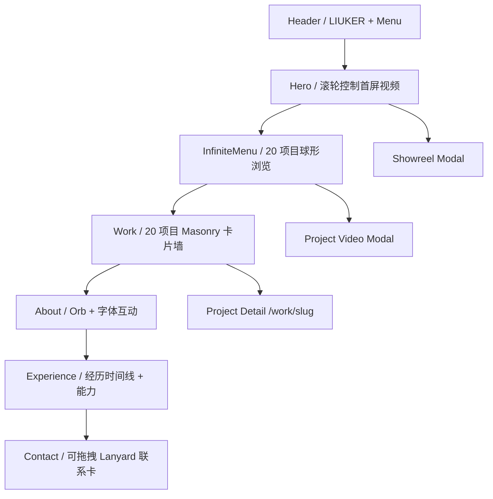

# LIUKER Portfolio — WorkBuddy 网页设计接手文档

> 版本：2026-08-14
> 用途：交给 WorkBuddy 或新的设计/开发协作者，继续完成 LIUKER 视频创作者作品集的网页设计。
> 范围：信息架构、视觉系统、页面布局、交互原则、响应式、可访问性与设计验收。
> 不包含：媒体工作台的内部实现、部署密钥、服务器运维细节。

---

## 1. 项目定位

LIUKER Portfolio 是一个以视频、动态设计与 CGI 为核心的双语个人作品集。它服务于招聘展示和个人品牌传播，不是通用型作品集模板。

设计关键词：

- 影像主导
- 编辑式排版
- 大字号、低装饰、强层级
- 暗色沉浸体验与浅色信息区交替
- 紫红到橙色的能量渐变
- 鼠标与滚轮参与叙事
- 高级但克制的 WebGL/Canvas 动效
- 招聘方可快速识别经历、能力和项目职责

品牌名称必须统一写作：`LIUKER`。

### 1.1 当前地址

- 线上网站：<https://liuker-portfolio.vercel.app/>
- GitHub：<https://github.com/HAHA-lh/Liuker_portfolio>
- 本地网站：通常为 `http://localhost:3000/`
- 本地媒体工作台：`http://127.0.0.1:4178/`

### 1.2 主要受众

1. 招聘方与创意负责人：需要快速判断工作方向、经历、能力与项目质量。
2. 品牌、制片或合作方：需要快速浏览影像风格并找到联系方式。
3. 同行与设计师：愿意探索更深入的互动和视觉细节。

因此，设计必须同时满足“第一眼有记忆点”和“信息可以快速扫描”。

---

## 2. 已确认、不可随意回退的设计决策

以下内容经过多轮调整，WorkBuddy 可以优化表现，但不要改变方向：

1. 品牌固定为 `LIUKER`，不要改回 LIKER。
2. 中文为默认语言，同时保留英文切换。
3. 默认深色主题，同时保留浅色主题。
4. 首屏是全屏视频，交互方式固定为“鼠标滚轮控制视频时间轴”。
5. 首屏不能自动从头播放，也不能恢复“鼠标左右移动控制播放”。
6. 首屏交互视频和 Showreel 是两套独立素材、两个入口。
7. Showreel 只在点击按钮后加载，不随页面首次打开预载完整视频。
8. 作品数量当前固定为 20 个，球形菜单和卡片墙共用同一份项目数据。
9. 保留全站鼠标互动，但不要恢复 SplashCursor 流体光迹。
10. About、InfiniteMenu、Lanyard 等高成本动画只在进入视口后初始化，离开视口必须暂停。
11. 页面内文字编辑只允许开发环境使用；生产部署后必须不可编辑。
12. 不允许为了视觉效果牺牲视频播放和滚轮响应的流畅性。

一句话原则：**视觉可以继续进化，但视频交互、加载策略和性能保护不能倒退。**

---

## 3. 当前信息架构



首页区块顺序必须保持清晰：

1. Header
2. Hero
3. InfiniteMenu 项目探索
4. Work 作品卡片墙
5. About
6. Experience + Toolkit + Capabilities
7. Contact

---

## 4. 全局视觉系统

### 4.1 颜色

当前主色变量位于 `app/globals.css`。

| 角色 | 当前值/方向 | 用途 |
|---|---|---|
| 深色背景 | `#0c0c0c`、`#050505` | 主页面、首屏、沉浸区 |
| 浅色纸张 | `#f2f0e9` | 经历时间线、信息对比区 |
| 主文字 | `#d7e2ea` | 深色背景上的正文和标题 |
| 次要文字 | `#88929c` 及透明灰 | 辅助信息、年份、说明 |
| 紫红强调 | `#b600a8` | 光晕、选中、渐变、交互反馈 |
| 橙色强调 | `#ff6a00` | 渐变终点、进度和能量反馈 |
| 浅色主题背景 | `#f3f0e9` | Light theme 页面背景 |
| 浅色主题文字 | `#161719` | Light theme 主文字 |

渐变建议继续围绕：

```css
linear-gradient(135deg, #b600a8, #ff6a00)
```

避免再加入高饱和蓝、绿色等新的主品牌色。项目图片可以多彩，但 UI 品牌色保持紫红—橙色体系。

### 4.2 字体

- 英文与数字主字体：`Kanit`
- 中文回退：`PingFang SC`、`Microsoft YaHei`
- 视觉标题：粗体、大字号、紧行高、偏编辑式构图
- 正文：轻字重、宽松行高、保留呼吸感
- 小标签：全大写或中文短标签，增加字间距

当前字体栈：

```css
font-family: "Kanit", "PingFang SC", "Microsoft YaHei", sans-serif;
```

不要混入过多字体。若要增加衬线体，只建议作为极少量品牌语气点缀，并需要同时测试中英文搭配。

### 4.3 宽度与栅格

- 页面内容最大宽度：`1600px`
- 宽容器类：`.container-wide`
- 页面横向边距：`clamp(1.15rem, 3vw, 3rem)`
- 沉浸区如 Hero 和 Contact 可全宽
- 信息区优先使用 2 栏、交错布局或中央轴线
- 手机端统一收为 1 栏，不允许横向溢出

### 4.4 圆角、描边与玻璃感

- 主按钮：胶囊形 `border-radius: 999px`
- 项目/经历卡片：大圆角，通常约 `1.3rem–4.5rem`
- 描边以低透明度灰白线为主
- 玻璃效果只用于菜单、语言切换和小型控件
- 大面积内容不要过度使用毛玻璃，避免削弱视频和图片主体

### 4.5 光影与背景

- 全局有低密度 DotField 和紫红/橙色径向光晕
- 光晕是氛围层，不应覆盖文字或阻挡点击
- 深色区允许局部 `mix-blend-mode: screen`
- 浅色区以纸张感、细线和微弱粉紫高光为主
- 不使用大面积噪点、液体拖尾或持续全屏粒子轰炸

---

## 5. 页面区块设计说明

## 5.1 Header 与 StaggeredMenu

### 当前结构

- 左上：LIUKER 品牌标记 + 小渐变圆点
- 右上：Menu 开关
- 菜单项：作品、关于、经历与技能、联系
- 菜单底部：主题切换、语言切换

### 设计要求

- Header 浮在首屏上方，不占用单独背景条。
- 品牌必须在视频上保持可读，但不应比 Hero 标题更抢眼。
- Menu 打开时采用分层滑入的紫红/橙色底层动画。
- 菜单必须具备清晰的关闭状态、编号、焦点状态和移动端全屏模式。
- 中文、英文切换后，菜单宽度和排版不能跳动得过于明显。

### 可继续优化

- 更精细的 Menu 打开前后颜色过渡。
- 菜单中的社交/联系方式在真实内容确认后补齐。
- LIUKER 标志可继续制作正式 SVG，但不要改变品牌拼写。

## 5.2 Hero：滚轮控制视频

### 当前结构

- 外部滚动区：桌面约 `340svh`，移动端约 `190svh`
- 内部舞台：`100svh` sticky
- 视频：全屏 `object-fit: cover`
- 首次进入：先展示 AVIF/WebP 海报
- 用户首次滚动后才设置视频 `src`
- 中央大字：`SHOWREEL`
- 底部左侧：LIUKER + 简介
- 底部右侧：Showreel 按钮 + 浏览作品
- 右侧：垂直滚动进度条
- 画面上有低透明 DotField 和 Demo Portfolio 圆章

### 核心交互

- 页面滚动进度映射到视频时间。
- 视频始终保持暂停，通过 seek 展示对应帧。
- SHOWREEL 大字透明度随滚动在约 `10%–70%` 之间变化。
- 视频画面随滚动有极轻微的 `1 → 1.12` 缩放。
- 底部信息随进度淡出并略微上移。
- Showreel 按钮打开独立弹窗，不改变首屏滚轮视频。

### 排版要求

- `SHOWREEL` 使用 8 个独立字符等距铺满屏幕宽度。
- 当前字号约 `clamp(6.6rem, 21.6vw, 24rem)`。
- 首字母与末字母应在视觉上接近屏幕左右边缘，但不能被裁切。
- 标题位于画面几何中心，避免长期遮住人物脸部；必要时可以根据最终视频构图微调垂直位置。
- 文本应是画面的第二层叙事，不要完全盖住主体。

### 不要做

- 不要改成普通自动播放背景视频。
- 不要用鼠标左右移动控制时间。
- 不要在页面加载时下载完整视频。
- 不要叠加高成本全屏流体特效。

## 5.3 InfiniteMenu：20 项目球形浏览

### 当前结构

- 顶部小标签：Selected Loop / 01–20、Drag to explore
- 中央 WebGL2 球体由 20 个项目封面圆片构成
- 拖拽旋转，松手后吸附到最近项目
- 左侧显示当前项目编号与标题
- 右侧显示分类与年份
- 中下方动作按钮打开项目视频

### 设计要求

- 球体是“探索入口”，不是作品信息的唯一入口；下方仍保留卡片墙。
- 当前项目信息必须在球体停止后稳定可读。
- 拖拽期间可以弱化标题，停止后再恢复。
- 交互提示需要在桌面和触摸设备上都成立。
- 当 WebGL2 不可用或用户减少动态时，需要保留静态/列表降级可能性。

### 可继续优化

- 球体与屏幕比例、项目圆片密度、选中反馈。
- 首次进入时的简短拖拽引导。
- 当前项目对应圆片的边缘光或轻微深度强调。

## 5.4 Work：Masonry / MagicBento 风格卡片墙

### 当前结构

- 20 个项目全部展示
- 不同高度形成 Masonry 节奏
- 封面、项目标题、分类、年份
- 桌面悬停时按需加载短预览视频
- 聚光、边缘发光、粒子、轻微倾斜和磁吸
- 点击可播放，另一入口进入详情页

### 设计要求

- 项目图像必须是第一视觉层级。
- 特效为轻微增强，不能让每张卡片都像独立霓虹组件。
- 卡片文字需在复杂封面上保持可读，可以使用底部渐变压暗。
- 同一时间只允许一个预览视频播放。
- 移动端没有 hover，不主动加载预览视频。

### 可继续优化

- 统一不同封面的裁切安全区。
- 为精选项目建立更明确的尺寸优先级。
- 补充项目角色或工具信息时，避免让卡片变成信息表格。

## 5.5 About：Orb + 字体互动

### 当前结构

- 深色沉浸区
- OGL Orb 作为大型动态背景
- 标签“关于这份作品集”
- 标题使用 TextPressure
- 正文使用 VariableProximity，鼠标靠近改变字重/字宽
- 内容居中，Orb 在周边形成边框/能量感

### 设计要求

- Orb 应包围或衬托信息，不要遮挡文字。
- 标题与正文必须始终可读，特别是浅色主题。
- VariableProximity 的变化应可感知但不影响阅读顺序。
- 鼠标离开区块或区块离开视口后停止渲染循环。

### 内容现状

About 介绍仍带有“作品集框架/演示占位”语气，后续应替换成真实个人介绍。这是内容优先级 P0。

## 5.6 Experience：编辑式经历时间线

### 当前结构

- 浅色纸张背景，与上下深色区形成强对比
- 大标题“经历时间线”
- 中央垂直线随滚动生长
- 三段经历左右交错
- 卡片带微弱粉紫光晕和大圆角
- 下方两栏：软件工具、专业能力

### 当前真实经历

1. `2025 — NOW`
   - `CGI视频创作者 / 自由职业`
   - `品牌短片、社交内容与动态视觉。`
2. `2021 — 2024`
   - `直播礼物动态设计`
   - `前期构思、中期制作、礼物上线`
3. `2018 — 2020`
   - `后期与动态设计`
   - `视觉研究、分镜与设计系统。`

### 软件工具

- Premiere Pro
- After Effects
- DaVinci Resolve
- Cinema 4D
- Blender
- Photoshop
- Illustrator
- Figma

### 专业能力

- 创意与分镜
- 导演与拍摄
- 剪辑与调色
- 动态图形与三维

### 设计要求

- 经历时间线首先是信息设计，不能为了动效降低扫描效率。
- 年份、卡片和中轴节点必须形成明确对应关系。
- 手机端改为左侧单轴、单列卡片。
- 浅色区域中的文字、线条和浅紫高光要满足可读对比。

## 5.7 Contact：Lanyard 联系卡

### 当前结构

- 全屏深色区
- 左侧：大标题、说明、联系按钮占位
- 右侧：Three.js + Rapier 可拖拽挂绳卡
- 背景有紫色光晕和大圆形描边
- 底部版权与说明

### 设计要求

- Lanyard 是联系行为的视觉记忆点，不应抢占真实联系方式。
- 真实邮箱、社交账号或招聘入口确认后，必须在左侧提供普通可点击文本/按钮。
- 卡片拖拽之外，键盘和移动端仍能完成联系操作。
- Lanyard 离开视口后停止渲染。

### 内容现状

真实联系方式仍是占位，这是内容优先级 P0。

## 5.8 项目详情页 `/work/[slug]`

### 当前结构

- 项目标题、分类、年份、职责、时长、工具
- 主视频
- Challenge / Process / Result
- 媒体展示区
- 下一项目入口

### 设计要求

- 保持首页的品牌系统，但详情页应更安静、更适合阅读。
- 视频是详情页主角，文字用于解释职责、过程与结果。
- 项目间的详情结构一致，素材比例可以不同。
- 长文本行宽应控制在舒适阅读范围。
- 下一项目入口需要有清晰封面和方向提示。

### 内容现状

20 个项目目前仍复用 6 套基础模板。后续应逐项补齐真实 summary、challenge、process、result 和 tools。

---

## 6. 全局交互语言

### 6.1 动效节奏

- 入场：通常 `0.5–0.8s`
- Hover：通常 `0.18–0.4s`
- 大区块或菜单：可用 `0.65–1s`
- Easing：偏 `power3/power4 out` 或平滑的自定义 cubic-bezier
- 避免每个元素同时弹跳、旋转或发光

### 6.2 鼠标反馈层级

1. 基础：按钮上移 1–2px、颜色或描边变化
2. 中级：卡片轻微磁吸、倾斜、边缘光
3. 高级：InfiniteMenu 拖拽、About 字体邻近、Lanyard 物理拖拽

同一区域只保留一个主要交互语言，不要同时叠加多个强反馈。

### 6.3 全局背景反馈

- DotField 响应鼠标，但必须保持低透明度。
- ClickSpark 只在点击时出现短促火花。
- Hero 可暂停全局 DotField，避免双层 Canvas 抢占 GPU。
- 不恢复 SplashCursor。

### 6.4 减少动态模式

当系统开启 `prefers-reduced-motion` 时：

- 取消或显著降低持续动画。
- Hero 仍可显示海报和基础信息。
- 不依赖动画才能获得内容。
- 拖拽控件应提供静态或点击替代方式。

---

## 7. 视频与图片在设计中的约束

这个项目以视频为主，视觉方案必须从媒体性能出发。

### 7.1 Hero

- 先显示轻量 AVIF/WebP 海报。
- 用户首次滚动后才加载滚轮视频。
- 桌面优先 1080p，低性能/小屏设备自动使用 720p。
- Hero 视频需要高密度关键帧，保证滚轮 seek 响应。
- 设计稿要预留 `object-fit: cover` 在不同屏幕产生的裁切。

### 7.2 项目卡片

- 首帧使用 AVIF/WebP。
- 预览视频只在桌面悬停时加载。
- 图片应提供主体安全区，不把重要文字或人物脸放在极边缘。

### 7.3 Showreel

- 点击后加载。
- 弹窗需有关闭按钮、Escape 支持、标题和时长信息。
- 不在首页首载阶段下载完整 Showreel。

### 7.4 素材设计建议

- 海报优先 16:9，同时考虑 Masonry 竖向/方形裁切。
- 每个项目最好准备一张“主体居中、可多比例裁切”的主封面。
- 需要透明背景动画时，先确认目标浏览器和编码方案，不直接用超大 PNG 序列上线。
- 原始母版不直接放进网页，网页只使用转码后的预览、完整视频和封面。

---

## 8. 响应式设计

主要断点：

- `900px`：双栏开始转单栏，Contact/Experience 重排
- `640px`：手机布局，时间线改左轴，隐藏次要提示

### 8.1 桌面端

- 强调大字号和横向空间。
- Hero 标题铺满宽度。
- InfiniteMenu 与 Lanyard 保留完整互动。
- Masonry 使用多列节奏。

### 8.2 平板端

- 保留大标题，但减少极端字号。
- 避免双栏内容互相挤压。
- 提前简化 WebGL 信息覆盖层。

### 8.3 手机端

- Hero 滚动区约 `190svh`，避免过长。
- Hero 标题不能横向溢出。
- 底部介绍和按钮需要可换行或纵向排列。
- InfiniteMenu 可以保留触摸拖拽，但交互提示要简化。
- Masonry 改为适合触摸的单列/少列布局，不依赖 hover。
- Experience 使用左侧时间轴和单列卡片。
- Contact 先显示联系信息，再显示 Lanyard。
- 所有可点击目标建议至少约 44×44px。

---

## 9. 可访问性要求

- 页面语言切换后，所有主导航、按钮和项目元数据同步变化。
- 深色和浅色主题都需要可读对比。
- 所有按钮、链接保留清晰的 `focus-visible` 状态。
- 视频弹窗使用 `role="dialog"`、可 Escape 关闭、包含基本焦点循环。
- 装饰 Canvas 不获取键盘焦点，不阻挡指针事件。
- 图片有内容意义时提供 alt；纯装饰图使用空 alt。
- 不以颜色作为唯一状态反馈。
- 动画不是获得内容的唯一方式。
- 生产环境不输出 `contenteditable`。

---

## 10. 内容与数据来源

### 10.1 网站文案

主要文件：`app/content.ts`

包含：

- 品牌名
- Hero 简介
- About
- Contact
- 导航
- 经历
- 软件工具
- 专业能力

长期文案必须同时维护中文 `zh` 和英文 `en`。

### 10.2 20 个项目

权威来源：`content/projects.csv`

数据流：

```text
content/projects.csv
    -> npm run content:sync
    -> app/project-rows.generated.ts
    -> app/content.ts 中的 projects
    -> InfiniteMenu / Masonry / Modal / Project Detail
```

不要直接编辑 `app/project-rows.generated.ts`。

### 10.3 开发环境文字编辑

- 只有 `npm run dev` 时，About、Experience、Toolkit、Capabilities 和 Contact 的部分文字可直接编辑。
- 编辑结果只保存在当前浏览器 localStorage。
- 永久内容必须写回 `app/content.ts` 或相关 JSX。
- 生产网站所有文字不可编辑。

---

## 11. WorkBuddy 修改时的文件地图

| 文件/目录 | 设计职责 | 注意事项 |
|---|---|---|
| `app/portfolio-home.tsx` | 首页结构、状态、弹窗、区块编排 | 不要破坏 Hero seek、按需加载与视口暂停 |
| `app/globals.css` | 全站视觉、布局、响应式 | 优先在此调整设计系统和区块样式 |
| `app/content.ts` | 双语主文案、经历、能力、模板 | 文案同时维护中英文 |
| `content/projects.csv` | 20 个项目资料和媒体路径 | 修改后运行 `npm run content:sync` |
| `app/components/` | React Bits 改造组件 | 不要用最新示例源码整段覆盖 |
| `app/work/[slug]/` | 项目详情页 | 保持静态生成与项目数据一致 |
| `app/layout.tsx` | Provider、全局 DotField、字体、分享元数据 | 不要重复挂载背景 Canvas |
| `public/media/` | 网页视频、海报、Showreel | 大视频由 Git LFS 管理 |

特别提醒：以下组件已经加入性能和生命周期改造，不能简单替换为 React Bits 原版：

- InfiniteMenu
- Orb
- Lanyard
- Masonry
- StaggeredMenu
- TextPressure
- VariableProximity
- DotField
- ClickSpark

---

## 12. 当前最值得继续设计的任务

### P0：内容真实性

1. 替换 About 占位介绍。
2. 配置真实邮箱、社交媒体或招聘入口。
3. 为 20 个项目补全真实职责、时长、工具、Challenge、Process、Result。
4. 修正项目标题、品牌名和英文拼写，统一从 CSV 更新。

### P1：视觉统一

1. 统一 20 张项目封面的裁切、安全区与色调展示策略。
2. 检查 Header、菜单、按钮和小标签在所有视频画面上的对比度。
3. 统一中文与英文字号层级，降低语言切换后的版式跳动。
4. 继续精修 Light theme，而不是只对 Dark theme 做反色。
5. 让项目详情页拥有与首页一致但更安静的编辑式排版。

### P2：移动端体验

1. 真机验证 Hero 标题、底部按钮、视频裁切。
2. 真机验证 InfiniteMenu 触摸拖拽和动作按钮。
3. 优化 Masonry 在小屏上的浏览节奏。
4. 确保 Experience 与 Contact 不产生超长空白或横向溢出。

### P3：视觉资产

1. 制作正式 LIUKER SVG 标志。
2. 更新 OG 社交分享图。
3. 为视频加载失败、WebGL2 不支持和减少动态模式设计静态降级画面。

---

## 13. WorkBuddy 输出规范

每次设计迭代建议同时交付：

1. 本次设计目标和要解决的问题。
2. 桌面端与移动端关键截图。
3. 深色与浅色主题截图。
4. 中文与英文状态截图。
5. 修改的文件清单。
6. 是否影响视频加载、Canvas/WebGL 或滚轮交互。
7. 对应的验收结果。

如果只提供设计稿，请标注：

- 画板尺寸
- 栅格和边距
- 字体、字号、行高、字重
- 色值和透明度
- 圆角与描边
- 动效时长、缓动和触发条件
- Desktop / Tablet / Mobile 差异
- 加载中、失败、减少动态等状态

---

## 14. 设计验收清单

### 品牌与内容

- [ ] 品牌始终为 LIUKER。
- [ ] 中英文内容都完整且没有溢出。
- [ ] 20 个项目的标题、年份、分类来自同一数据源。
- [ ] 联系方式和 About 不再使用演示占位内容。

### Hero

- [ ] 首屏先显示海报，首次滚动后才请求视频。
- [ ] 滚轮可向前和向后平滑控制视频。
- [ ] 没有鼠标左右控制，也没有自动从头播放。
- [ ] SHOWREEL 大字在各尺寸下不被异常裁切。
- [ ] Showreel 只在点击后加载。

### 作品

- [ ] InfiniteMenu 包含 20 个项目并能正确打开项目。
- [ ] Masonry 显示正确数量、封面、标题和年份。
- [ ] 项目预览视频按需加载，同一时间只播放一个。
- [ ] 手机端不依赖 hover 才能访问操作。

### About / Experience / Contact

- [ ] Orb 和字体互动不会妨碍阅读。
- [ ] 经历时间线年份、节点和卡片对应清晰。
- [ ] Contact 的真实联系入口不依赖 3D 拖拽。
- [ ] Orb、InfiniteMenu、Lanyard 离开视口后暂停。

### 主题、响应式与可访问性

- [ ] 深色和浅色主题都具有可读对比。
- [ ] 900px、640px 附近没有布局断裂。
- [ ] 页面没有横向滚动条。
- [ ] 键盘焦点清晰，弹窗可 Escape 关闭。
- [ ] `prefers-reduced-motion` 下内容仍完整可用。
- [ ] 生产构建不包含编辑按钮或 `contenteditable`。

---

## 15. 给 WorkBuddy 的最短工作指令

可以直接把下面这段与本文件一起交给 WorkBuddy：

> 请先阅读 `docs/LIUKER-WORKBUDDY-DESIGN-HANDOFF.md` 和项目根目录 `AGENTS.md`，再继续设计 LIUKER Portfolio。优先解决真实内容、视觉统一和移动端体验。保持首屏“滚轮控制视频时间轴”、点击后加载独立 Showreel、20 项目共用数据源、生产环境不可编辑、WebGL/Canvas 视口暂停等已确认约束。视觉调整优先修改 `app/globals.css`，结构交互修改前先核对 `app/portfolio-home.tsx`；不要手改 `app/project-rows.generated.ts`，也不要用 React Bits 示例源码整段覆盖当前组件。每次迭代请提供桌面/手机、深色/浅色、中文/英文截图和修改文件清单。

---

## 16. 本地检查命令

```bash
npm install
npm run dev
```

如果修改了项目 CSV：

```bash
npm run content:sync
```

提交前至少运行：

```bash
npx tsc --noEmit --pretty false
npm run build
```

只有在项目所有者明确要求同步或发布时，才提交、推送并触发 Vercel 部署。
